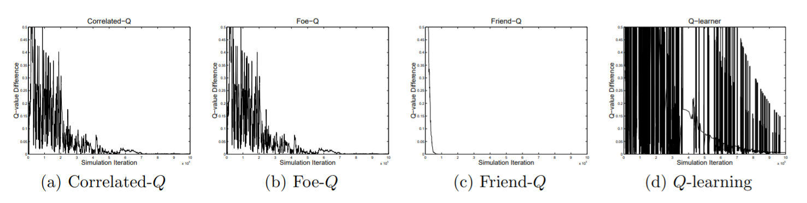
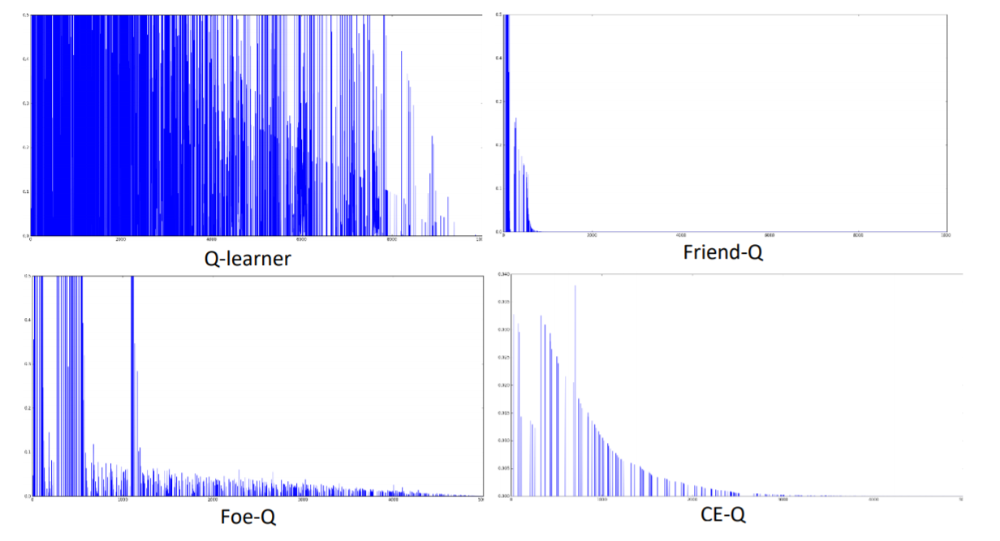

# Correlated-Q-Learning

The goal of this project is to replicate results from <a href="http://www.aaai.org/Papers/ICML/2003/ICML03-034.pdf">“Correlated-Q Learning” by Amy Greenwald and Keith Hall</a>, Figure 3 (parts a-d). 

 
Convergence in the soccer game. All algorithms—except Q-learning—converge. As above, the CE-Q algorithm shown is uCE-Q - *from “Correlated-Q Learning”*

## Environment - Soccer Game
All the experiments were run on zero-sum grid game - the soccer. The grid world was represented by 2x4 array. Each state, s, was represented by 3 values: who has the ball, position of agent 1 (A1), position of agent 2 (A2). 2 agents cannot occupy the same cell, so there are 112 states in total. Actions, a, available are [N,S,E,W,Put], represented as [-4,4,1,-1,0]. Rewards, R, are +100 if an agent with the ball scores (get into goal state, -100 to opponent) and -100 scores himself (+100 to opponent). Transitions were handles by transition function, that takes s and a and outputs next state (s’). This function also account for going out of boundaries, randomly picks first player, considers collision constrains and handles ball passing.

## Error function
Error was computed as a difference for s[1,2,1] and a[4,0] before and after a game (until someone scores). Game was terminated if no agent scored after 25 iterations.

## Learners
Q Learning – good old classic 
Q-learner algorithm was a regular Q-learner except joint action vector was used (Q[s,a1,a2]). 
When implementing Q learner, I referenced formula 4 [1] which states that Q-table must be updated based on join action space. However, when Q-learner picks the best action for update, “the best” action from join action space is the one that will benefit both players, turning Q-learner into Friend-Q. This contradicted with the point authors were trying to make, since Q-learner was supposed to be “isolated” and never converge due to lack of knowledge about another agent. To achieve this, I created Q-table for each agent with only s and his set of actions (112x5). This approach demonstrated that traditional Q learning cannot lean in multiagent environment by not converging

**Friend-Q** *– “I’m sure you will do what is best for me”* 
Friend-Q learner naively assumes that opponent will take an action that would maximize his reward, to the point that is expects an opponent to score himself. Friend-Q was implemented by joining actionspaces of both agents and running regular Q-learner as explained earlier.

**Foe-Q** *– “Why do you hate me so much? It’s OK, I’m prepared”* 
Foe-Q learner utilizes adversary strategy, in which each agent picks an action that minimizes opponent’s rewards, even if this action is not the best choice for himself [2]. Foe-Q uses minimax function, in which an agent first finds opponent’s action that minimizes his rewards, and then maximizes his expected reward based on such distribution. I used CVXOPT linear programming (LP) library for minimizing part. Minimizing function takes Q[s] and outputs probabilistic action space (PAS) that minimizes agent’s rewards based on opponent’s actions. The best action is then selected by agent with respect to PAS and Q table is updated accordingly.

**CE-Q** *– “OK, let’s find a compromise? Actually, I don’t care, as long as I know CE”* 
CE-Q learner strategy uses correlated-equilibria. At each state, correlated equilibrium is found using LP. I implemented utilitarian CE-Q (uCE-Q), in which CE maximizes the sum of both agent’s rewards. For that, I first computed probabilistic action space (PAS) that maximizes each agent’s rewards. Next, using PAS and agent’s Q tables, I found the most optimal action to take at given state for each agent. Next, using these actions and PAS table, I found s’ and updated Q tables.

## Assumptions
Authors of the paper did not specify parameters for their learners, such as learning rate α, ε, decay rate, and initial values of Q tables. Because of that I made following assumption:
-	Initial values of Q table were random and ε was set to .9 and decayed over time after each iteration until it reached .001. These would encourage agents to try different states before “settling down”. Because rewards are at least couple steps away from initial states, agents must explore the environment
-	Game always starts at the state [1,2,1]

## Results
 

## Analysis
Q-learner and Friend Q learner matched the graphs from the paper very closely. Foe-Q had expected randomness at the beginning, and then slowly converged. CE-Q graph did not match paper’s graphs closely. It was less dense and “spiky”. I believe this was caused by high learning rate at the beginning and low number of iterations. It did converge, however. The main challenge with Foe-Q and CE-Q learners was execution time. Both leaners used LP at each iteration, which was time consuming. I did not have enough computational power to execute 1,000,000 games, so I limited my experiments on 10,000 games. I compensated by selecting appropriate parameters for α and ε, which speeded up convergence. I believe this one of the main factors contributing to low performance of CE-Q.

## Executing details
* env.py - creates soccer game environment
* Q.py - regular Q-Learner
* Friend.py - Friend-Q Learner
* Foe.py - Foe-Q Learner
* CEQ.py - CE-Q Learner

## References:
1. “Correlated-Q Learning” by Amy Greenwald and Keith Hall (http://www.aaai.org/Papers/ICML/2003/ICML03-034.pdf)
2. “Friend-or-Foe Q-learning in General-Sum Games” by Michael L. Littman (https://www.cs.rutgers.edu/~mlittman/papers/icml01-ffq.pdf)
